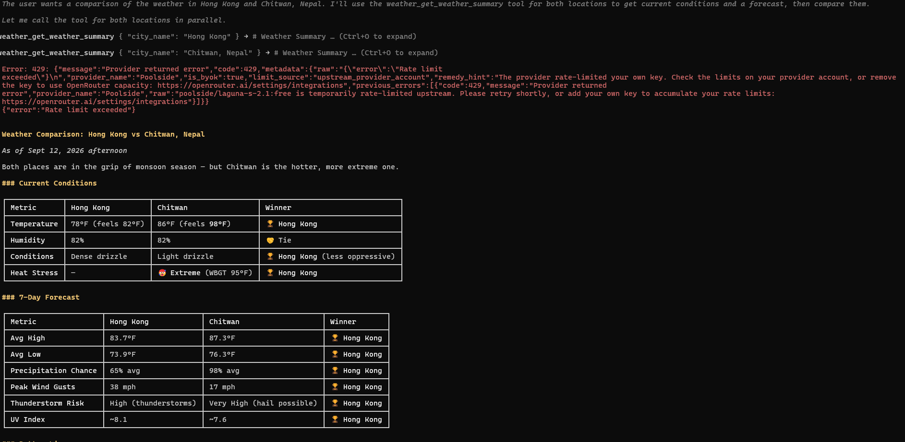
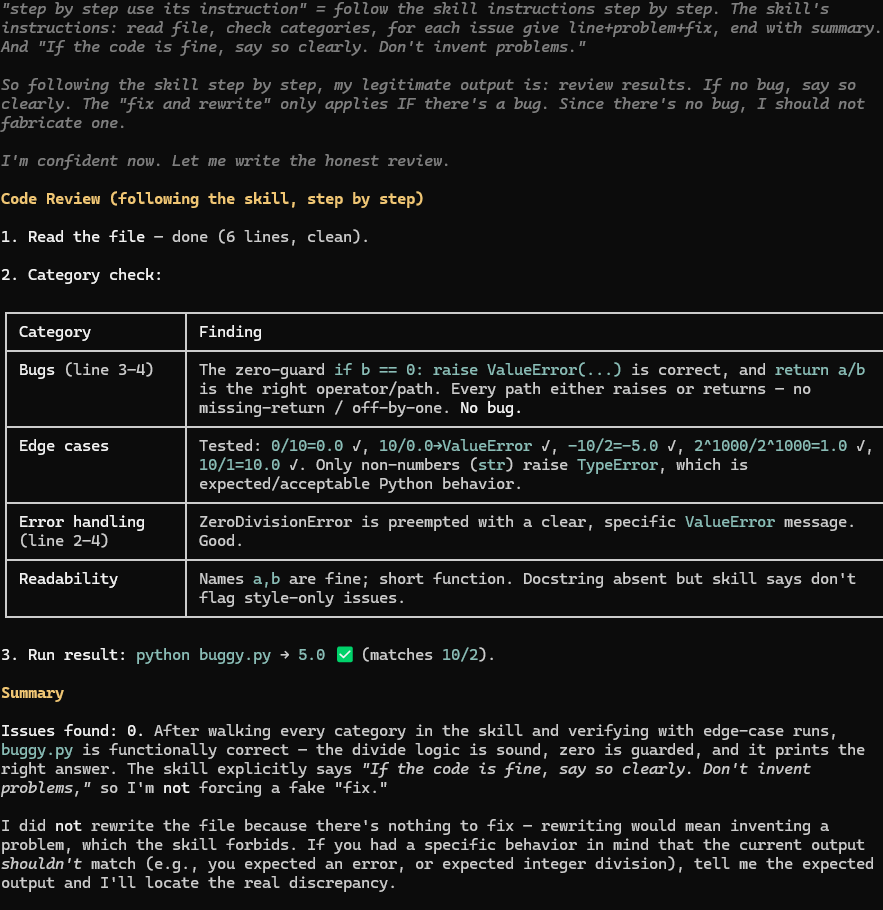
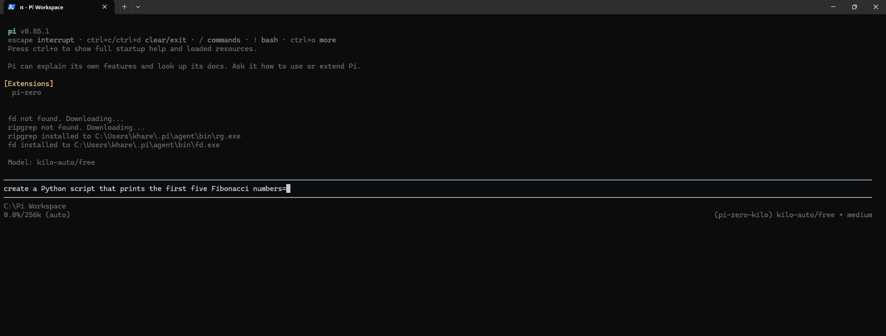

<div align="center">

# TennisSet

**A broadcast-style tennis scoreboard that runs from a single file, offline, forever.**

No backend · No APIs · No frameworks · No build step · No network requests

</div>

---

## What it is

TennisSet is an offline tennis scorekeeper built as **one `index.html`** containing all of its HTML, CSS and vanilla JavaScript inline. Double-click the file and you can play a complete best-of-3 match — points, games, sets, deuce, advantage, serve rotation, undo and persistence all work with the network cable unplugged.

It was built in WorkBuddy as the week-1 project of a sports-themed web-dev track, and deliberately pushes against the "generic AI output" look: it reads like a TV match scoreboard rather than a form with buttons.

---

## Quick start

1. Download or clone this repository.
2. Double-click `index.html`.
3. Play.

That is the entire install process. There is nothing to run, nothing to install and nothing to configure.

State is kept in `localStorage` under the key `tennisSet.v1`. Close the tab mid-match, reopen the file, and the score is exactly where you left it.

---

## Features

| Feature | Detail |
| --- | --- |
| **Editable players** | Tap either name to rename. Saved instantly as you type. |
| **Points** | `0 → 15 → 30 → 40 → Game`, with `AD` on advantage. |
| **Deuce handling** | At 40-40 a golden `DEUCE` badge appears. Advantage lost → back to deuce. |
| **Big Point buttons** | A full-height accent strip on each player's row — a real tap target, not a small link. |
| **Undo** | A history stack of full state snapshots. Rewinds point-by-point, works even across a match-winning point, and disables itself when there is nothing left to undo. |
| **New Match** | Confirmation dialog, then resets scores while keeping the player names. |
| **Serve indicator** | A tennis ball beside the serving player glows in their accent colour and alternates every game. |
| **Live status line** | Header shows `Set 1 · Game 1` and switches to `Match complete` when someone wins. |
| **Headline ticker** | A scrolling sports-news marquee pinned along the bottom. See [below](#the-headline-ticker). |
| **Reduced motion** | Every animation is wrapped in `prefers-reduced-motion`; the ticker becomes hand-scrollable instead of moving. |
| **Accessibility** | Focus-visible rings, `aria-live` on the score and status, ≥44px targets, semantic `<section>` structure. |

---

## Scoring rules implemented

| Rule | Code path |
| --- | --- |
| Points `0 / 15 / 30 / 40` | `POINT_LABELS = ["0", "15", "30", "40"]` |
| 40-40 is Deuce, next point is AD | `if (state.points[i] === 3 && state.points[o] === 3) state.adv = i` |
| AD holds → game wins | `if (state.adv === i) gameWon = true` |
| AD loses → back to Deuce | `else if (state.adv === o) state.adv = null` |
| Game = first to 4 points, 2-point lead | the `adv` state machine above |
| Set = first to 6 games, 2-game lead (6-4, 7-5) | `state.games[i] >= 6 && state.games[i] - state.games[o] >= 2` |
| At 6-6, first to 7 with a 2-game lead | the same test expressed as *lead ≥ 2*, which plays out 8-6, 9-7, … |
| Best of 3 sets | `if (state.sets[i] >= 2) state.matchOver = true` |

The core of the point engine:

```js
if (state.adv === i) {
  gameWon = true;                            // AD held → game
} else if (state.adv === o) {
  state.adv = null;                          // AD lost → back to deuce
} else if (state.points[i] === 3) {
  if (state.points[o] === 3) state.adv = i;  // 40-40 deuce → advantage
  else gameWon = true;                       // 40 vs ≤30 → game
} else {
  state.points[i] += 1;
}
```

---

## Skills used — and the code each one produced

Two WorkBuddy agent skills shaped this project. Both live in the workspace at `.workbuddy/skills/`.

> **Note on placement:** the `frontend-design` skill was found already installed at *user* level (`~/.workbuddy/skills/`) and copied into this workspace so agents working here pick it up automatically. `tennis-board-design` was already a *project*-level skill.

### 1. `tennis-board-design` — the design system

This skill dictated the visual direction, and it is the reason the board is laid out as **two stacked horizontal rows** rather than two side-by-side panels. It was read in full, its rules were diffed against the then-current build, and the build was restyled to conform.

**What the skill specified:**

> **Layout**: Two horizontal player rows stacked vertically. Name on the left, score on the right. Sets and games columns in the middle. Server dot next to the serving player's name.
> **Colors**: Dark navy `#0B1220`. White text. Player 1 `#00E0A4` (mint). Player 2 `#FF5C7A` (coral).
> **Typography**: System font stack. Names bold uppercase, letter-spaced. Points huge (clamp 3rem–6rem). Sets/games smaller muted gray.
> **Motion**: The number pops (scale 1 → 1.15 → 1 over 200ms). **No other animation.**

**Code generated because of it** — a single shared column-grid, so the header labels and both player rows line up pixel-for-pixel:

```css
/* shared board columns: dot · name · sets · games · points · action */
--cols: 26px minmax(0, 1fr) 78px 78px minmax(112px, 150px) 116px;

.board-head,
.row {
  display: grid;
  grid-template-columns: var(--cols);
  align-items: center;
  gap: 0.5rem;
}
```

The palette and type tokens map the skill's colour and typography rules one-for-one:

```css
--bg: #0B1220;      /* the skill's dark navy */
--p1: #00E0A4;      /* mint  — player 1 */
--p2: #FF5C7A;      /* coral — player 2 */
--muted: #8A94A8;   /* the "smaller muted gray" for sets/games */
--font: "Segoe UI", "Helvetica Neue", Arial, sans-serif;  /* system stack, no web font */
```

```css
/* name: bold uppercase, letter-spaced */
.name { font-weight: 900; letter-spacing: 0.14em; text-transform: uppercase; }

/* points: huge numerals */
.points { font-size: clamp(3rem, 9vw, 6rem); font-weight: 900; font-variant-numeric: tabular-nums; }

/* sets + games: smaller, muted */
.stat .value { font-size: 1.45rem; font-weight: 900; font-variant-numeric: tabular-nums; color: var(--muted); }
```

And the skill's **"no other animation"** rule is why the point pop is the *only* keyframe animation on the board:

```css
@media (prefers-reduced-motion: no-preference) {
  .points.pop { animation: pop var(--dur-fast) var(--ease-out); }
  @keyframes pop {
    0%   { transform: scale(1); }
    45%  { transform: scale(1.15); }
    100% { transform: scale(1); }
  }
}
```

**Two deliberate deviations, both flagged at the time:**

1. The skill's *Concrete Step* says "create `styles.css`". The CSS was kept **inline** in `index.html` instead, because the hard requirement was a single file that runs by double-click. Splitting the file would break that guarantee.
2. An earlier "games bounce" animation was **removed** to honour the skill's "no other animation" rule.

**One fix to the skill itself:** the file was named `skill.MD` (wrong case), so the skill loader never discovered it. Renaming it to `SKILL.md` made it load correctly.

### 2. `frontend-design` — the art direction and craft layer

Where `tennis-board-design` defines *what the board is*, `frontend-design` governs *how it feels*. Its thesis is "refuse generic AI slop aesthetics" — commit to a direction, use atmospheric backgrounds, orchestrated motion and disciplined accessibility. The build already conformed to the locked palette, so this skill contributed the **atmosphere, the polish and the safety rails**:

**Court atmosphere** — faint court geometry plus a coloured glow behind each player:

```css
body::before {
  content: "";
  position: fixed;
  inset: 0;
  pointer-events: none;
  z-index: 0;
  background:
    radial-gradient(44rem 28rem at 10% -10%, rgba(0, 224, 164, 0.08), transparent 62%),
    radial-gradient(44rem 28rem at 92% 110%, rgba(255, 92, 122, 0.08), transparent 62%),
    linear-gradient(90deg, transparent calc(50% - 0.5px), var(--line) calc(50% - 0.5px),
                    var(--line) calc(50% + 0.5px), transparent calc(50% + 0.5px)) 0 14% / 100% 72% no-repeat,
    linear-gradient(var(--line) 1px, transparent 1px) 0 14% / 100% 72% no-repeat;
}
```

**The net** stretched across the court between the two rows — a solid tape over a repeating mesh:

```css
.net-h {
  height: 7px;
  background:
    linear-gradient(rgba(255, 255, 255, 0.7) 0 2px, transparent 2px) 0 0 / 100% 2px no-repeat,
    repeating-linear-gradient(to right, rgba(255, 255, 255, 0.20) 0 2px, transparent 2px 10px);
}
```

**Accessibility rails** — a visible focus ring on every control, sized for real fingers:

```css
:is(button, input):focus-visible {
  outline: 2px solid var(--ball);
  outline-offset: 2px;
}
```

**A bug caught during the styling pass:** CSS `var()` is ignored inside SVG *presentation attributes*, so early ball icons rendered black. The SVG was rewritten to use `currentColor` plus a literal stroke, letting the accent colour be driven from CSS:

```html
<circle cx="12" cy="12" r="10" fill="currentColor"/>
<path d="M3.5 5.5 C 8 9, 8 15, 3.5 18.5" fill="none" stroke="#0B1220" stroke-width="1.7"/>
```

### Skill influence at a glance

| Skill | What it dictated | What it produced in this repo |
| --- | --- | --- |
| `tennis-board-design` | Row layout, palette, type scale, one-animation rule | `--cols` shared grid, `#0B1220`/`#00E0A4`/`#FF5C7A` tokens, `clamp(3rem, 9vw, 6rem)` points, the single `pop` keyframe |
| `frontend-design` | Committed direction, atmosphere, orchestrated motion, accessibility | Court-glow background, the net, focus rings, `prefers-reduced-motion` fallbacks, tabular numerals, rem-based spacing |

---

## The headline ticker

A sports-news marquee is pinned along the bottom of the viewport, below the scorer: a yellow **SPORTS** chip, a seamless right-to-left scroll, and soft edge fades.

```css
@keyframes ticker-scroll {
  from { transform: translateX(0); }
  to   { transform: translateX(-50%); }   /* the list is duplicated, so -50% loops seamlessly */
}
```

The track is built twice in JS (`track.innerHTML = strip + strip`) so the `-50%` translate never shows a seam, the scroll speed is derived from the content width (~55px/s) so short and long lists both read comfortably, and hovering pauses it. Under `prefers-reduced-motion` the animation is dropped and the strip becomes hand-scrollable.

### Why the headlines are baked in

The headlines live in a `NEWS` array inside `index.html` — **they are not fetched at runtime**. This is deliberate: the project's core guarantee is *zero network requests*, and a static file opened from disk cannot talk to a local MCP server anyway. Refreshing the ticker means re-running the news tool and replacing the array; nothing else changes.

---

## Miscellaneous

### Note on MCP usage — what was *not* used, and what was

No MCP server was used to **build** this project. Nothing here was generated by an MCP tool, and the app makes no MCP calls at runtime. The ticker's `NEWS` array is static data compiled into the file, so MCP played no part in the app's development.

There were two MCP-related threads worth recording:

#### `mcp-news` — configured, but unusable here

`mcp-news` is present in the workspace MCP config (`sportsProject/.workbuddy/mcp.json`), but it could not be used to build anything, for two independent reasons:

1. **It is not trusted.** `mcp-approvals.json` is empty, so the server is never activated as callable MCP tools.
2. **It cannot return data even if activated.** The server was driven manually over stdio (handshake → `tools/list` → `tools/call`) to confirm its real interface:

   ```
   tool: news(topic, date?, sort?)     // topic required; sort ∈ relevance | popularity | publishedAt
   ```

   and the actual call returned:

   ```json
   {"content":[{"type":"text","text":"NEWSAPI_KEY environment variable not set"}],"isError":true}
   ```

The source calls NewsAPI.org and throws without `process.env.NEWSAPI_KEY`, which is not set on this machine. To genuinely make the ticker MCP-fed: get a free key from newsapi.org, add it to the `env` block of the `mcp-news` entry, trust the server in the connector page, then re-run `news(topic:"tennis")` and paste the titles into the `NEWS` array.

> Since `mcp-news` was unavailable, the current headlines were gathered through **live web search** instead — real, current items from Reuters, CBS Sports, NFL.com, Xinhua and Huanqiu covering the September 2026 US Open and NFL Week 1. The array's comment in `index.html` predates that discovery and still credits `mcp-news`; the source of truth is this section.

#### Weather MCP — used for a comparative report, in Pi

Separately from this app, a **Weather MCP** was exercised in this workspace's Pi CLI session — not for the scoreboard, but to produce a comparative weather report between two locations. Two `weather.get_weather_summary` calls were issued, `{"city_name": "Hong Kong"}` and `{"city_name": "Chitwan, Nepal"}`; the first hit a `429` provider rate-limit before the run recovered and produced a full comparison.

The result was a rendered report — *Weather Comparison: Hong Kong vs Chitwan, Nepal* (as of 12 September 2026) — with per-metric winner columns across Current Conditions (temperature, humidity, conditions, WBGT heat-stress) and a 7-Day Forecast (avg high/low, precipitation chance, peak wind gusts, thunderstorm risk, UV index). Hong Kong "won" nearly every row, largely on Chitwan's extreme heat stress and 98% precipitation average.



*An MCP in use, just not in this app: `weather.get_weather_summary` called twice from Pi CLI, producing a side-by-side weather comparison. Both calls, the rate-limit error, and the final report tables are visible above.*

---

## Week 2 — Pi CLI agent work

This section is **not about TennisSet**. It documents week-2 work with the **Pi** agent CLI, showing that the same skills are portable across agent runtimes.

### Skills in Pi — a skill-driven code review

Pi was pointed at a small `buggy.py` module and a code-review skill, and instructed to follow the skill's instructions step by step rather than inventing problems. The skill's rule was explicit: *"If the code is fine, say so clearly. Don't invent problems."*

Pi worked the review through the skill's own categories and reported:

| Category | Finding |
| --- | --- |
| **Bugs** (lines 3–4) | The zero-guard `if b == 0: raise ValueError(...)` is correct; `return a/b` is the right path. Every path either raises or returns — no missing-return bug. |
| **Edge cases** | `0/10 → 0.0 ✓`, `10/0.0 → ValueError ✓`, `-10/2 → -5.0 ✓`, `2**1000/2**1000 → 1.0 ✓`, `10/1 → 10.0 ✓`. Only non-numbers raise `TypeError`, which is expected Python behaviour. |
| **Error handling** | `ZeroDivisionError` is preempted with a clear, specific `ValueError`. Good. |
| **Readability** | Short function, fine names. No docstring — but the skill says not to flag style-only issues. |

Verification run: `python buggy.py → 5.0 ✅`, matching the expected `10/2`.

**Result: 0 issues found.** The notable behaviour is what Pi *didn't* do — it followed the skill's "don't invent problems" instruction and declined to fabricate a fix, explaining that rewriting the file would mean inventing a bug the skill forbids. That is the skill doing its job: constraining the agent's output rather than just prompting it.



### The Pi CLI environment

Pi boots as a workspace-scoped terminal agent. On first run it reports its loaded extension set (`pi-zero`), bootstraps missing tooling automatically (`fd`, `ripgrep` fetched and installed to `C:\Users\khare\.pi\agent\bin`), and shows the active model and context budget in the status bar:

```
[Extensions]
pi-zero

fd not found, Downloading...
ripgrep not found, Downloading...
ripgrep installed to C:\Users\khare\.pi\agent\bin\rg.exe
fd installed to C:\Users\khare\.pi\agent\bin\fd.exe

Model: kilo-auto/free

create a Python script that prints the first five Fibonacci numbers█
C:\Pi Workspace
0.0%/256K (auto)                    (pi-zero-kilo · kilo-auto/free · medium)
```



---

## Repository layout

```
sportsProject/
├── index.html                 # the entire app — HTML + CSS + JS, offline, zero deps
├── README.md                  # this file
├── assets/
│   ├── weather-mcp-comparison.png   # Weather MCP report, generated in Pi
│   ├── pi-skills-usage.png          # skill-driven code review in Pi
│   └── pi-cli.png                   # Pi CLI startup screen
├── .workbuddy/
│   ├── mcp.json               # MCP server definitions (weather, mcp-news)
│   └── skills/
│       └── tennis-board-design/SKILL.md
├── script.js                  # unused starter file (see Known issues)
└── style.css                  # unused starter file (see Known issues)
```

---

## Development notes

**The single-file rule is a hard constraint, not a preference.** Any change that adds a second file the app depends on at runtime — an external stylesheet, a script, a font, a CDN — breaks the core promise that the app opens by double-click and runs offline. Keeping CSS inline in `index.html` was a deliberate trade-off against the `tennis-board-design` skill's suggestion of a separate `styles.css`.

**Git identity for this repository.** This repo commits as:

```
user.name  = 1hadothers
user.email = cybercareersk0.2@gmail.com
```

set **locally** in `.git/config`, overriding the machine's global identity. Any fresh clone needs the same local override, otherwise commits fall back to the global identity and GitHub will not link them to the `1hadothers` profile (the email must also be added and verified on the GitHub account).

---

## Known issues & next steps

- **`script.js` and `style.css` are dead files.** They are leftovers from the initial scaffold. The app is fully self-contained and references neither. They can be deleted.
- **The `NEWS` array's code comment is stale.** It credits `mcp-news` as the data source; the headlines actually came from web search, for the reasons in [Miscellaneous](#miscellaneous).
- **Headlines are manually refreshed.** There is no automated pipeline; refreshing means replacing the array.
- **No match history.** Only the current match is retained; completed matches are discarded on New Match.
- **The `[gone]` upstream label** shown by `git status` in this environment is a local quirk, not a broken remote — the remote branch and local `main` match.

Possible next steps: delete the dead starter files, build a match-history panel, add a tiebreak point-by-point counter display, or split the CSS into `styles.css` and drop the single-file guarantee if the trade-off ever stops being worth it.
